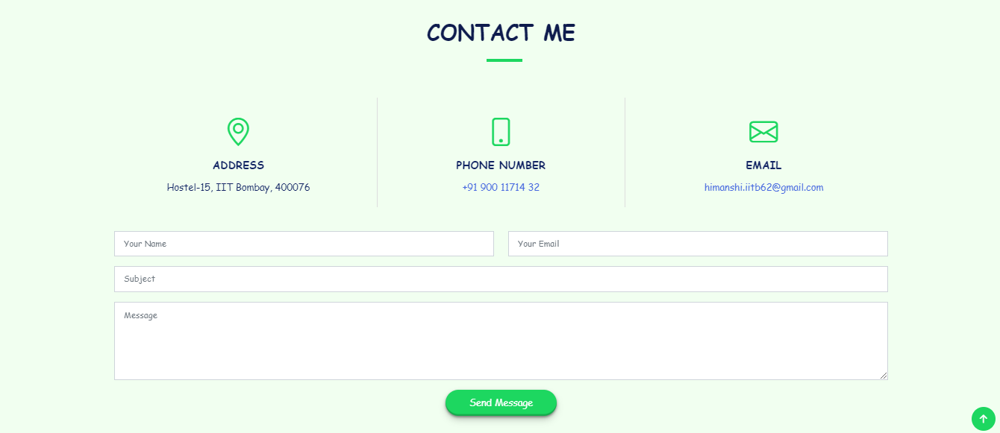
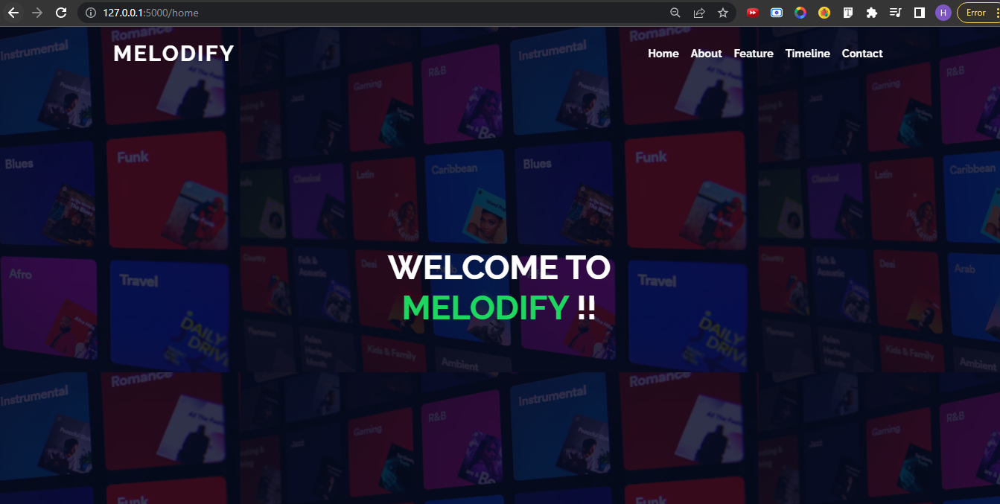
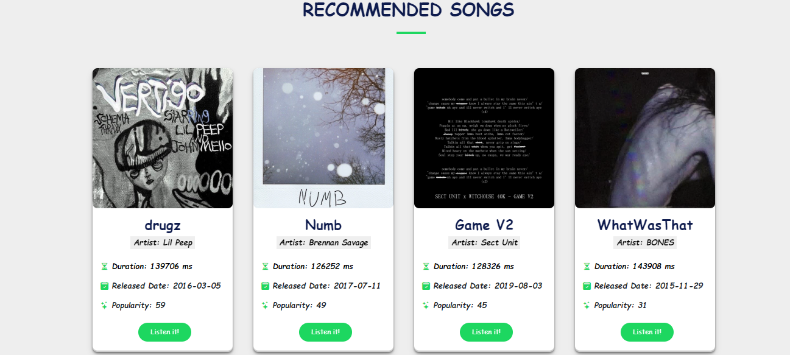

# Melodify - Music Recommendation Web App
## Submission for Microsoft Engage 2022 🌟
 
Melodify is a Flask web application for music recommendation that uses the Spotify API and dataset to recommend songs with *sorted algorithm* for popularity and artists' top albums depending on the user's input. Heroku is where this web application is hosted.


## Features and Interfaces

1. Landing Page 
   - Seamless landing page with `Get Started` button for Recommendation System Page 
   - 
 
   - Some of the app's most notable features
   - 
   
   - On my landing page, you can see a timeline of my travels over the last four weeks.
   - 

   - Witness by journey of these 4 weeks, feel free to discuss anything through this contact form at footer
   - 

2. Home page 
   - The landing page redirects to **Melodify** after selecting **Get Started** on the landing page!!
   - 
   
   - Melodify was created using these three algorithms and here user search for the songs to get recommendation from particular recommendation engine.
   - 
   
   - Spotify's New Releases can be found here and listen it on Spotify by clicking on it.
   - 

   - Newly 2022 Spotify's made playlist.
   - 
   
3. Demo of working of Recommendation Engine-1
   ## Recommendation System Using Euclidean Distance
   - Choose recommendation engine-1 and type in the name of a song as an input.
   - 

   - After clicking the recommend button, the page loads to the Recommend Songs page, which displays recommended songs along with their details for a certain song input. To listen to it on Spotify, click the Listen button.
   - 

   - The top albums by that artist may be found by clicking on their name.
   - 

4. Recommendation Engine-2
   ## Recommendation System Using Cosine Similarity Distance
   - Cosine similarity is a mathematical value that measures the similarities between vectors. Imagining our songs vectors as only two-dimensional, the visual representation would look similar to the figure below.
   - 

4. Recommendation Engine-3
   ## Recommendation System Using Correlation Distance

6. The rapid growth of data collection has led to a new era of information. Data is being used to create more efficient systems and this is where Recommendation Systems come into play. Recommendation Systems are a type of information filtering systems as they improve the quality of search results and provides items that are more relevant to the search item.

## How to get OAuthenication token to run the application?

1. Authorization into Spotify Account:
For this, it is required to go to Spotify Web API (https://developer.spotify.com/dashboard/) and login with my credentials id :
Email_id: himanshi97151@gmail.com
Password : IITBOMBAY 
2. Go to https://developer.spotify.com/console/get-current-user/ for get the authentication token and click on **Get Token** button

3. Click on **Request Token**

4. After confirming that it it my account, click on **Agree**
5. Copy the OAuth Token 

6. Paste it in model1.py and app.py at required position to run the application 

### Application Stack

- Backend: Flask, Jinja2, Python
- API used: Spotify-API
- Frontend: HTML, CSS, Bootstrap, Javascript
- Libraries: Numpy, Pandas, Scikit-Learn
- Deployment: Heroku

### Instructions
- Clone the repo into your local machine
```
git clone https://github.com/Srijha09/Rhythmify.git
```

- Log in into Developers account with my login credentials and get the OAuth token and paste in the py files https://developer.spotify.com/dashboard/login
- Install requirements
```
$ pip install -r requirements.txt
```
- Once the application is cloned and the account is setup, run the command **python app.py** in the terminal


## Useful Links
- [Deployed Website]()
- [Demo Video]()


## Need help?

Feel free to contact me on [LinkedIn](www.linkedin.com/in/himanshi-yadav-a01b2920a) 


---------

```javascript

if (youEnjoyed) {
    starThisRepository();
}

```

-----------

